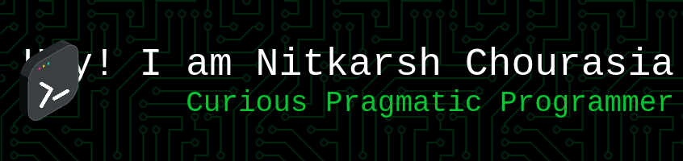

 <!-- Fisher-Yates -->

  
  
  
  
  
  
  
  
  

# 💫 About Me:
I am currently working on myself. Would like to take myself to the next level. The greatest love I do is with myself. I love taking things to the next level.

## 🌐 Socials:
          

# 💻 Tech Stack:
                   
# 📊 GitHub Stats:
 
 

## 🏆 GitHub Trophies

### ✍️ Random Dev Quote

### 😂 Random Dev Meme

---

<!-- Proudly created with GPRM ( https://gprm.itsvg.in ) -->
# NitkarshChourasiaWeb
